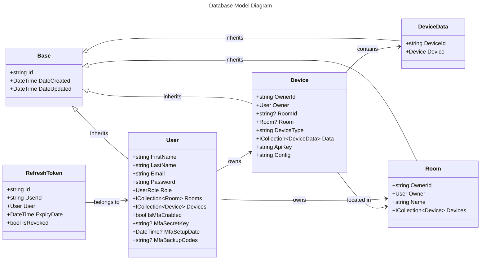

```mermaid

---
title: Database Model Diagram
---

classDiagram

    direction LR

    class Base {
        +string Id
        +DateTime DateCreated
        +DateTime DateUpdated
    }

    class Device {
        +string OwnerId
        +User Owner
        +string? RoomId
        +Room? Room
        +string DeviceType
        +ICollection~DeviceData~ Data
        +string ApiKey
        +string Config
    }

    class DeviceData {
        +string DeviceId
        +Device Device
    }

    class RefreshToken {
        +string Id
        +string UserId
        +User User
        +DateTime ExpiryDate
        +bool IsRevoked
    }

    class Room {
        +string OwnerId
        +User Owner
        +string Name
        +ICollection~Device~ Devices
    }

    class User {
        +string FirstName
        +string LastName
        +string Email
        +string Password
        +UserRole Role
        +ICollection~Room~ Rooms
        +ICollection~Device~ Devices
        +bool IsMfaEnabled
        +string? MfaSecretKey
        +DateTime? MfaSetupDate
        +string? MfaBackupCodes
    }

    Base <|-- Device : inherits
    Base <|-- DeviceData : inherits
    Base <|-- Room : inherits
    Base <|-- User : inherits

    User --> Room : owns
    User --> Device : owns
    Device --> DeviceData : contains
    Device --> Room : located in
    RefreshToken --> User : belongs to

```
